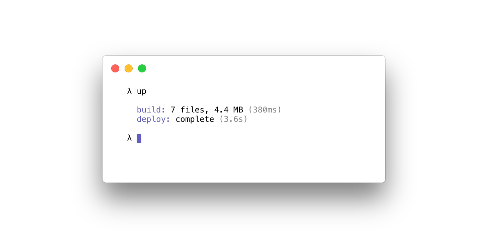
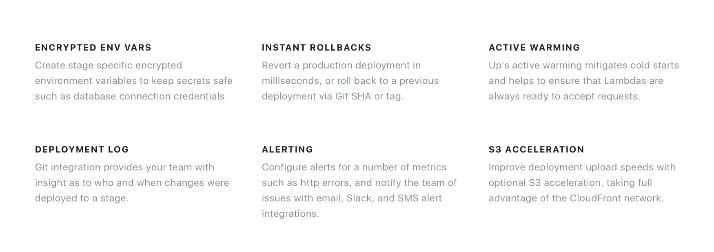

Up deploys infinitely scalable serverless apps, APIs, and static websites in seconds, so you can get back to working on what makes your product unique.

Up focuses on deploying "vanilla" HTTP servers so there's nothing new to learn, just develop with your favorite existing frameworks such as Express, Koa, Django, Golang net/http or others.

Up currently supports Node.js, Golang, Python, Java, Crystal, Clojure and static sites out of the box. Up is platform-agnostic, supporting AWS Lambda and API Gateway as the first targets. You can think of Up as self-hosted Heroku style user experience for a fraction of the price, with the security, isolation, flexibility, and scalability of AWS.

Check out the [documentation](https://up.docs.apex.sh/) for more instructions and links, or try one of the [examples](https://github.com/apex/up-examples), or chat with us in [Slack](https://chat.apex.sh/).



## Features

Open source community edition.


## Pro Features

Up Pro is **$20/mo USD** for unlimited use within your company, with no additional cost per team member. Up Pro is currently in early-access alpha, please use the **up-early-adopter-57AAA8693354** coupon for 50% off indefinitely. Head over to [Subscribing to Up Pro](https://up.docs.apex.sh/#guides.subscribing_to_up_pro) to get started.

Note that the following Pro features are currently available:

 - Encrypted env variables
 - Alerting (email, sms, slack)
 - S3 upload acceleration (optional)
 - Instant rollback support



## Quick Start

Install Up:

```
$ curl -sf https://up.apex.sh/install | sh
```

Create an `app.js` file:

```js
require('http').createServer((req, res) => {
  res.end('Hello World\n')
}).listen(process.env.PORT)
```

Deploy the app:

```
$ up
```

Open it in the browser, or copy the url to your clipboard:

```
$ up url -o
$ up url -c
```

## Donations

We also welcome financial contributions for the open-source version on [Open Collective](https://opencollective.com/apex-up). Your contributions help keep this project alive!

### Sponsors

<a href="https://opencollective.com/apex-up#backers" target="_blank"></a>

### Backers

<a href="https://opencollective.com/apex-up#backers" target="_blank"></a>


<a href="https://apex.sh"></a>
