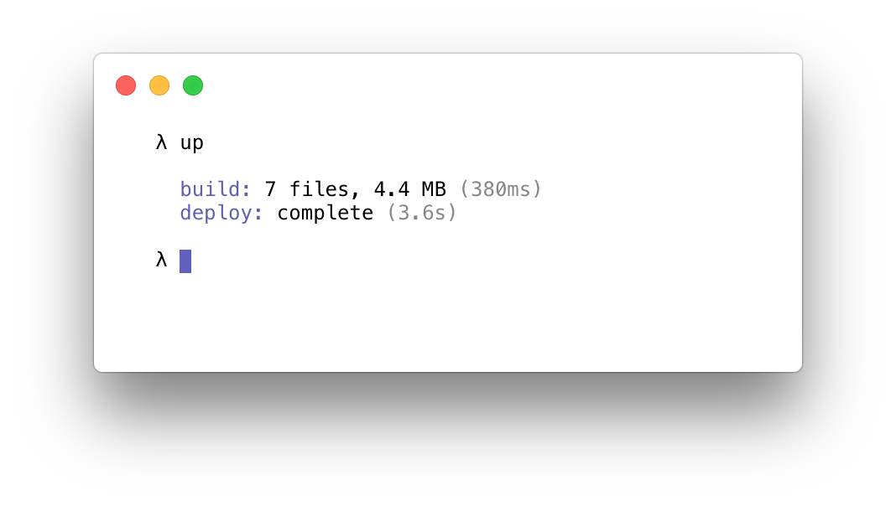
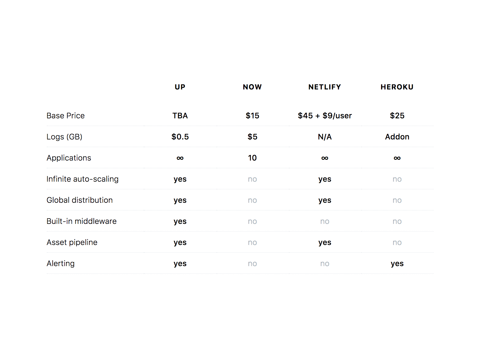

Up deploys infinitely scalable serverless apps, APIs, and static websites in seconds, so you can get back to working on what makes your project unique. Up focuses on deploying "vanilla" apps, there's nothing new to learn, just develop with your favorite existing frameworks like Express, Koa, Django, Golang net/http or others.

Up currently supports Node.js, Golang, Python, Crystal, and static sites out of the box. Up is provider-agnostic, supporting AWS Lambda and API Gateway as the first targets. You can think of Up as self-hosted Heroku style user experience for a fraction of the price, with the security, flexibility, and scalability of AWS.

Check out the [documentation](https://apex.github.io/up/), [examples](https://github.com/apex/up-examples), or chat with us in [Slack](https://apex-dev.azurewebsites.net/). Up is still very early in development, if you have no AWS experience you may want to hold off for a future release.

## Features

Open source community edition: Coming soon.

## Pro Features

Close sourced pro edition: Coming less soon.

## Pricing

Updated as of July 2017 based on public information. Some services offer a restricted free version, or free access for solo developers – this table is based on commercial use.

## FAQ

  
Is this a hosted service?

  
There are currently no plans for a hosted version. Up lets you deploy applications to your own AWS account for isolation, security, and longevity, don't worry about a startup going out of business.

  
What platforms does Up support?

  
Currently AWS via API Gateway and Lambda are supported, this is the focus until Up is nearing feature completion, after which additional providers such as GCP and Azure will be added.

  
How is this different than other serverless frameworks?

  
Most of the AWS Lambda based tools are function-oriented, while Up abstracts this away entirely. Up does not use framework "shims", the servers that you run using Up are regular HTTP servers and require no code changes for Lambda compatibility.

  
This keeps your apps and APIs portable, makes testing them locally easier, and prevents vendor lock-in. The Lambda support for Up is simply an implementation detail, you are not coupled to API Gateway or Lambda.

  
Why run HTTP servers in Lambda?

  
You might be thinking this defeats the purpose of Lambda, however most people just want to use the tools they know and love. Up lets you be productive developing locally as you normally would, Lambda for hosting is only an implementation detail.

  
With Up you can use any Python, Node, Go, or Java framework you'd normally use to develop, and deploy with a single command, while maintaining the cost effectiveness, self-healing, and scaling capabilities of Lambda.

  
How much does it cost to run an application?

  
AWS API Gateway provides 1 million free requests per month, so there's a good chance you won't have to pay anything at all. Beyond that view the <a href="https://aws.amazon.com/api-gateway/pricing/">AWS Pricing</a> for more information.

  
How does it scale?

  
Up scales to fit your traffic on-demand, you don't have to do anything beyond deploying your code. There's no restriction on the number of concurrent instances, apps, custom domains and so on.

  
How much latency does Up's reverse proxy introduce?

  
With a 512mb Lambda function Up introduces an average of around 500µs (microseconds) per request.

  
Why is Up licensed as GPLv3?

  
Up is licensed in such a way that myself as an independent developer can continue to improve the product and provide support. Commercial customers receive access to a premium version of Up with additional features, priority support for bugfixes, and of course knowing that the project will stick around! Up saves your team countless hours maintaining infrastructure and custom tooling, so you can get back to what makes your company and products unique.

  
Can I donate?

  
Yes you can! Head over to the <a href="https://opencollective.com/apex-up">OpenCollective</a> page. Any donations are greatly appreciated and help me focus more on Up's implementation, documentation, and examples. If you're using the free OSS version for personal or commercial use please consider giving back, even a few bucks buys a coffee :).

## Community

- [Documentation](https://apex.github.io/up/) for Up
- [Twitter](https://twitter.com/tjholowaychuk)
- [Example applications](https://github.com/apex/up-examples) for Up
- [Slack](https://apex-dev.azurewebsites.net/) to chat with apex(1) and up(1) community members
- [Blog](https://blog.apex.sh/) to follow release posts, tips and tricks
- [Wiki](https://github.com/apex/up/wiki) for article listings, database suggestions, etc

